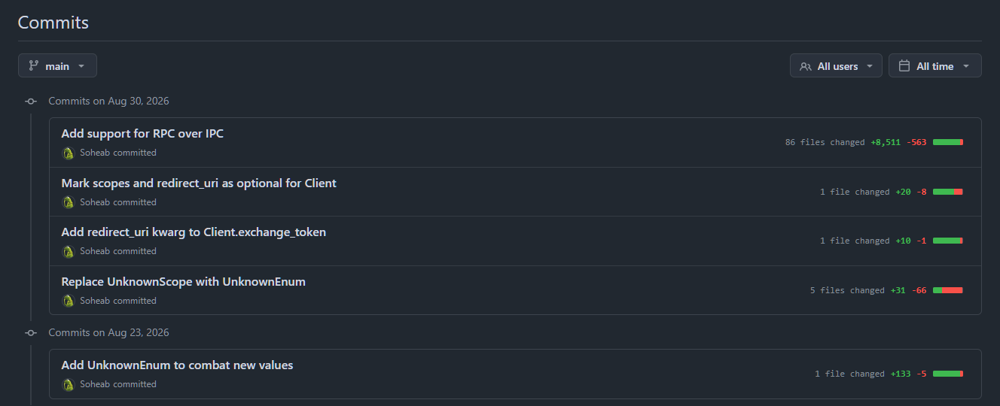
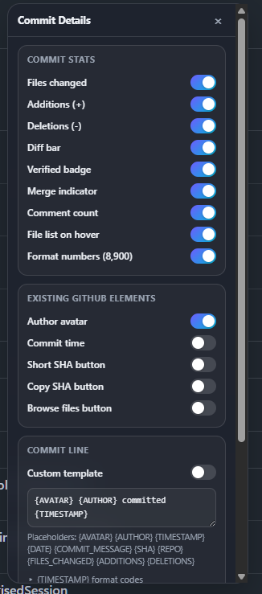
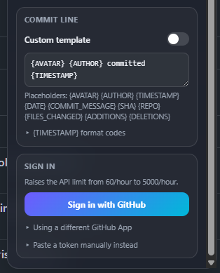
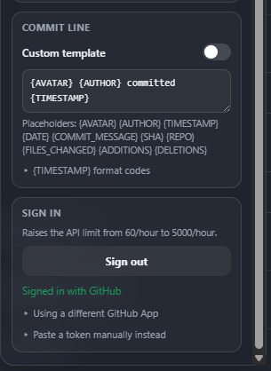

# GitHub Commit Details

A Chrome extension that adds richer per-commit info to GitHub's commit list pages
(`github.com/<owner>/<repo>/commits/<branch>`): files changed, additions/deletions,
a mini diff bar, verified-signature badges, merge indicators, comment counts, and a
file list on hover. Fully customizable, so you can toggle any of it off, or hide
GitHub's own avatar, commit time, or SHA button, right from the popup.

Everything is local to your browser. Settings are stored with `chrome.storage.local`
and nothing is sent anywhere except `github.com` and `api.github.com`.



## Features

- **Per-commit stats** on every row: files changed, additions (+), deletions (-)
- **Diff bar**, a small green/red bar showing the proportion of additions to deletions
- **Verified badge** when a commit's signature checks out
- **Merge indicator** for merge commits
- **Comment count** when a commit has review comments
- **File list on hover**: hovering the stats shows every changed file as a tooltip
- **Comma-formatted numbers** (`8,511` vs `8511`), toggleable
- **Toggle any GitHub element off**: author avatar, commit time, SHA button, copy-SHA
  button, browse-files (`<>`) button
- **Custom commit line**, so you can replace "X committed Y ago" with your own
  template using placeholders (author, avatar, timestamp, commit message, SHA, repo,
  stats)
- **Flexible timestamp formatting** in the custom template: relative by default, or
  any of nine format codes (short time, long date, full date+time, etc.)
- **Sign in with GitHub** via OAuth Device Flow. One click, no password, no manual
  token needed, and it raises the API rate limit from 60/hour to 5,000/hour
- **Manual token support** as a fallback, if you'd rather paste your own
- **Toolbar popup** for quick settings access
- **Draggable in-page panel** (floating "GC" button) that stays open on the page
  instead of closing the instant you click elsewhere, and remembers where you left it
- **Everything local**: settings, tokens, and preferences live only in
  `chrome.storage.local`, nothing is synced or sent anywhere except `github.com` and
  `api.github.com`

## Install

1. Clone this repository (or download it as a ZIP and extract it).
2. Open `chrome://extensions` in Chrome (or any Chromium browser, like Edge or Brave).
3. Turn on **Developer mode** (top-right toggle).
4. Click **Load unpacked** and select the folder you cloned/extracted.
5. Pin the extension (puzzle-piece icon in the toolbar, then pin) for quick access to
   the popup.

### Updating

If you cloned the repo, pull the latest changes, then hit the reload icon on the
extension's card in `chrome://extensions` (no need to remove and re-add it):

```
git pull
```

If you downloaded a ZIP instead, download and extract the latest version over the
old folder, then reload the extension the same way.

Then visit any GitHub commits page, e.g. `https://github.com/<owner>/<repo>/commits/main`.

## Sign in (recommended)

GitHub's public API allows 60 unauthenticated requests per hour, per IP. That's
enough for a quick look, but a commit list page can burn through it fast. Signing in
raises the limit to 5,000/hour.

Click the extension icon, then **Sign in with GitHub**. A GitHub tab opens with a
short code pre-filled; approve it, and the popup will show **✓ Signed in with
GitHub** within a few seconds. No password or app install is needed on GitHub's
side. This uses GitHub's OAuth **Device Flow**, which issues a token to the
extension without ever exposing a client secret.

If you'd rather use your own token, expand **Paste a token manually instead** at the
bottom of the popup and paste a
[personal access token](https://github.com/settings/tokens) (no scopes needed for
public repos).

### Using your own GitHub App instead

The extension ships with a built-in GitHub App Client ID so sign-in works out of the
box. If you'd rather sign in through your own app:

1. Create a [new GitHub App](https://github.com/settings/apps/new) (or OAuth App).
2. Enable **Device Flow** in its settings.
3. Copy its **Client ID**. This is not secret, but never enter a client *secret*
   anywhere in this extension; it isn't needed.
4. In the popup, expand **Using a different GitHub App** and paste the Client ID.

## What it shows

On every commit row:

- **Files changed**, **additions (+)**, **deletions (-)**, with numbers optionally
  comma-formatted (`8,511` vs `8511`)
- A small green/red **diff bar** giving a proportional at-a-glance sense of the change
- A **✓ Verified** badge when the commit's signature checks out
- A **⑂ Merge** tag for merge commits
- A **💬 comment count** when a commit has review comments
- Hovering the stats shows the **list of changed files** as a tooltip

Any of these, plus GitHub's own avatar, commit time, SHA button, copy button, and
browse-files (`<>`) button, can be turned off, per your preference. Changes apply
immediately, no page reload needed.

### Custom commit line

By default the line under each commit title reads like GitHub's own ("Soheab
committed 3 hours ago"). Turn on **Custom template** and you can rewrite it with
placeholders:

```
{AVATAR} {AUTHOR} committed {TIMESTAMP}
```

Available placeholders: `{AVATAR}` `{AUTHOR}` `{TIMESTAMP}` `{DATE}`
`{COMMIT_MESSAGE}` `{SHA}` `{REPO}` `{FILES_CHANGED}` `{ADDITIONS}` `{DELETIONS}`.

`{TIMESTAMP}` supports format codes, written as `{TIMESTAMP:CODE}`, so you're not
stuck with relative time everywhere:

| Code | Output | Description |
| --- | --- | --- |
| `{TIMESTAMP}` | 3 hours ago | Relative (default, no code needed) |
| `{TIMESTAMP:R}` | 3 hours ago | Relative (same as default, explicit) |
| `{TIMESTAMP:t}` | 16:20 | Short Time |
| `{TIMESTAMP:T}` | 16:20:30 | Medium Time |
| `{TIMESTAMP:d}` | 04/20/2021 | Short Date |
| `{TIMESTAMP:D}` | April 20, 2021 | Long Date |
| `{TIMESTAMP:f}` | April 20, 2021 at 16:20 | Long Date, Short Time |
| `{TIMESTAMP:F}` | Tuesday, April 20, 2021 at 16:20 | Full Date, Short Time |
| `{TIMESTAMP:s}` | 04/20/2021, 16:20 | Short Date, Short Time |
| `{TIMESTAMP:S}` | 04/20/2021, 16:20:30 | Short Date, Medium Time |

e.g. `{AUTHOR} · {TIMESTAMP:D}` renders as "Soheab · April 20, 2021".

Settings live in the toolbar popup, and also in a small draggable panel you can open
directly on the commits page (a floating "GC" button in the corner). That's handy
since the toolbar popup closes as soon as you click elsewhere. Drag it by its header
to wherever it doesn't cover the commit list; it remembers where you left it.

<p>
  
  
  
</p>

## How it works

- A content script (`content.js`) scans each commit row, reads the owner/repo/SHA
  straight from GitHub's own row markup, and calls
  `GET /repos/{owner}/{repo}/commits/{sha}` on the GitHub REST API.
- Results are cached per session so re-scrolling or re-rendering doesn't refetch.
- A `MutationObserver` (plus GitHub's `turbo:load`/`pjax:end` events) keeps it working
  as you navigate GitHub's single-page app.
- Sign-in runs entirely client-side via OAuth Device Flow, polled from a background
  service worker so it keeps working even if you close the popup while approving.

## Privacy

- No data leaves your browser except requests to `github.com` (sign-in) and
  `api.github.com` (commit stats), which is exactly what you'd get browsing GitHub
  normally.
- Your token, sign-in state, and preferences live only in `chrome.storage.local`.
  They're local to this browser, not synced to any account or server.

## Uninstall / sign out

- **Sign out**: open the popup (or the in-page panel) and click **Sign out**. This
  clears the stored token.
- **Uninstall**: `chrome://extensions`, then remove. This also clears all stored
  settings and tokens for the extension.
